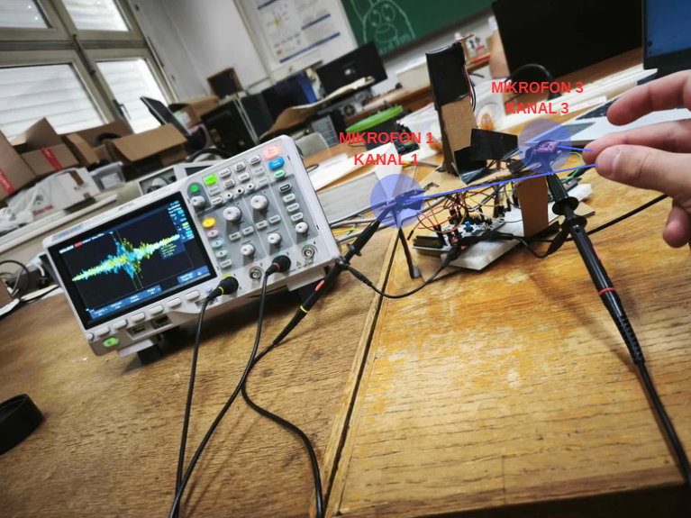
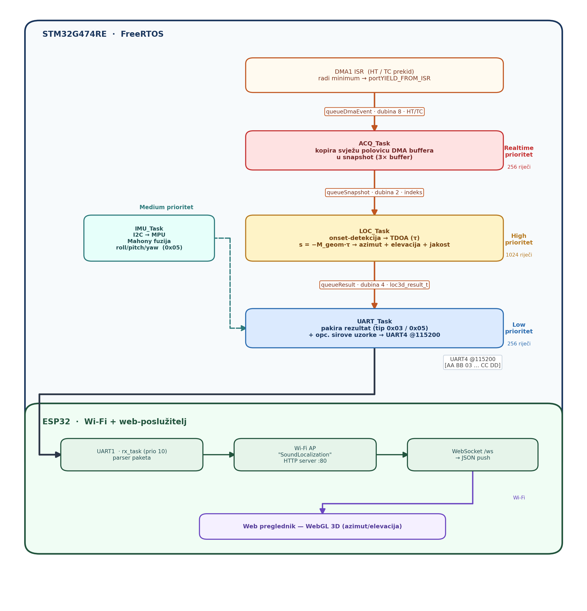
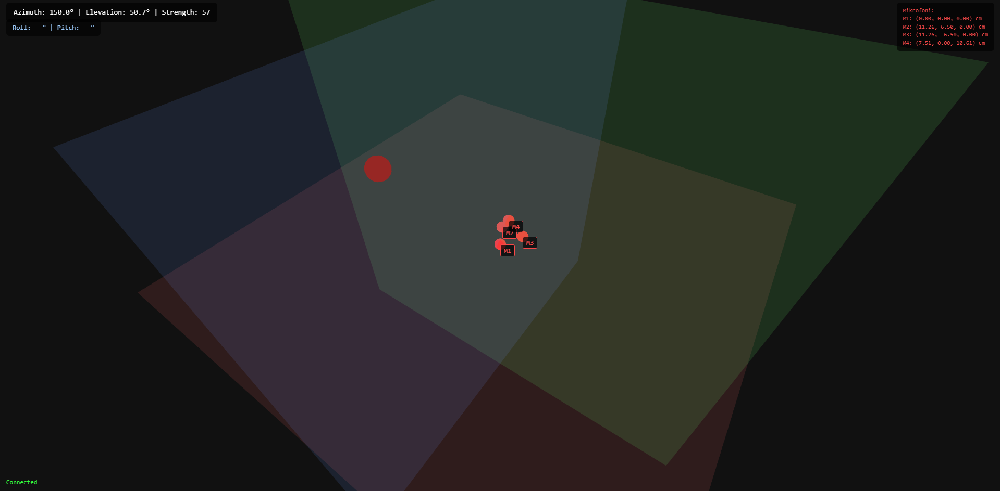
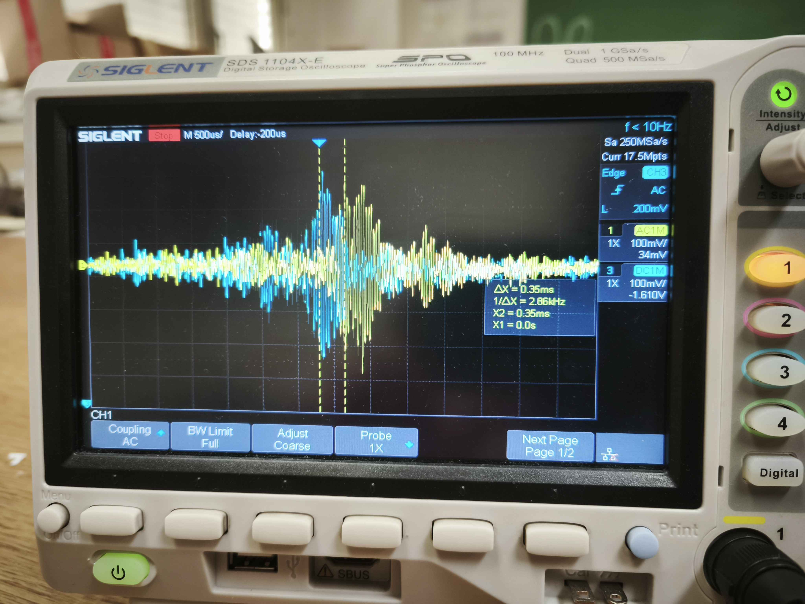

# Sound Source Localization Using a Microphone Array

Real-time sound source localization on an **STM32G474RE** microcontroller, with wireless
**3D visualization** in a web browser served by an **ESP32**.

A four-channel microphone array captures sound through ADC sampling with DMA transfer, and
the direction of arrival is estimated from **time differences of arrival (TDOA)**. The TDOA
is computed directly in the time domain — by detecting the *onset* of the sound wave in each
channel — and azimuth and elevation follow geometrically from those differences. The array
orientation is measured with an MPU-9250 IMU and fused with a complementary/Mahony filter.
The result is sent over UART to the ESP32, which serves a WebGL visualization.



## Repository layout

| Directory | Description |
| --- | --- |
| [`Sound Localization/`](Sound%20Localization/) | STM32CubeIDE project (STM32G474RE, FreeRTOS) — acquisition, TDOA, IMU, UART |
| [`ESP32_Visualization/`](ESP32_Visualization/) | ESP-IDF project — UART parser, Wi-Fi AP, HTTP/WebSocket server, WebGL visualization |
| [`docs/images/`](docs/images/) | Figures used in this document |

The core STM32 sources live in [Sound Localization/Core/CustomDriverSet/](Sound%20Localization/Core/CustomDriverSet/)
(`adc_driver.c`, `dma_driver.c`, `sound_loc3d_4mic_time.c`, `loc3d_3mic_time.c`, `mpu9250.c`, `uart_driver.c`);
tasks and queues are set up in [task_manager.c](Sound%20Localization/Core/Src/task_manager.c).

## Hardware

- **4 × SparkFun BOB-19389** — Knowles SPH8878LR5H-1 analog MEMS microphone with an OPA344
  preamplifier (×64 gain, ½·V<sub>CC</sub> DC bias, ≈ 600 Ω output impedance)
- **NUCLEO-G474RE** — Cortex-M4F @ 170 MHz, 12-bit ADC, DMA, FPU
- **ESP32 DevKit V1** — 2.4 GHz Wi-Fi, HTTP/WebSocket server
- **MPU-9250 (GY-9250)** — accelerometer + gyroscope over I2C (400 kHz, PB8/PB9)

The array is a **regular tetrahedron with a 13 cm edge**: M1 is the reference at the origin,
M2/M3 are symmetric about the X axis, and M4 sits above the base centroid at a height of
10.61 cm. Coordinate frame: +X forward (azimuth 0°), +Y left (90°), +Z up.

ADC mapping: M1 → PB14 (ADC1_IN5), M2 → PC0 (IN6), M3 → PC1 (IN7), M4 → PC2 (IN8).
STM32 → ESP32 link: UART4 TX (PC10) → GPIO16, 115200 baud, 8N1.

## How it works

| Parameter | Value |
| --- | --- |
| Sampling rate | ≈ 192 kHz per channel (TIM8 TRGO, ARR = 884) |
| ADC | 12-bit, 4-rank scan, 42.5 MHz clock, 24.5-cycle sampling time |
| Per-channel conversion | 870.6 ns (corrected as a sequential channel offset) |
| Maximum TDOA | τ<sub>max</sub> = d/c ≈ 379 µs ≈ 73 samples |
| TDOA resolution | ± T<sub>s</sub>/2 ≈ 2.6 µs |
| DMA buffer | circular, ping-pong, 4 × 1024 samples (uint16) |

1. **Acquisition** — TIM8 triggers ADC1 in scan mode; circular DMA fills the buffer and the
   HT/TC interrupt signals which half is ready.
2. **Onset detection** — for each channel, the first sample whose deviation from the quiescent
   level (2048) exceeds the threshold (250), searched over a sliding window spanning two
   consecutive halves.
3. **TDOA → direction** — onset index differences are scaled by T<sub>s</sub>, the sequential
   ADC offset is corrected, and the direction follows from the linear system
   **s** = −c·**D**⁻¹**τ**. Three microphones give azimuth assuming s<sub>z</sub> ≥ 0; the
   fourth resolves the sign of elevation as well (κ(**D**) ≈ 2.0).
4. **Transport and display** — the result goes over UART to the ESP32, which broadcasts it as
   JSON over WebSocket and renders it in a WebGL scene.



Processing is split across four FreeRTOS tasks connected by message queues:
`ACQ_Task` (Realtime) → `LOC_Task` (High) → `UART_Task` (Low), plus an independent `IMU_Task`
(BelowNormal, ≈ 100 Hz sensor reads, ≈ 20 Hz orientation packets).

### Communication protocol

Binary frames delimited by **SOF `0xAA 0xBB`** and **EOF `0xCC 0xDD`**, big-endian:

| Type | Meaning | Length | Payload |
| --- | --- | --- | --- |
| `0x02` | 2D direction | 8 B | AZ (int16, 0.1°), STR |
| `0x03` | 3D direction | 10 B | AZ, EL (int16, 0.1°), STR |
| `0x04` | raw samples | var. | NCH, N, then NCH×N samples (uint16) |
| `0x05` | orientation | 12 B | Roll, Pitch, Yaw (int16, 0.1°), FLAGS |

```
[0xAA][0xBB][0x03][AZ_H][AZ_L][EL_H][EL_L][STR][0xCC][0xDD]
```

The ESP32 parses the stream with a state machine; a corrupted byte costs at most one packet,
since synchronization re-establishes itself at the next SOF.

## Web application

The ESP32 brings up its own Wi-Fi access point and serves the page straight from firmware
(HTML/CSS/JS embedded as a static array — no internet access and no external libraries).

| | |
| --- | --- |
| SSID / password | `SoundLocalization` / `soundloc123` |
| Address | `http://192.168.4.1` |
| Endpoints | `GET /`, `GET /api/microphones`, `GET /ws` (WebSocket) |

```json
{"type":"sound","azimuth":123.4,"polar":51.0,"strength":82}
{"type":"orient","roll":12.3,"pitch":10.3,"yaw":0.0,"mag":0}
```

The scene draws the microphone positions, three reference planes and the direction of arrival
(a red sphere that fades over 5 s, keeping the last 20 detections). The whole scene tilts with
the roll/pitch reported by the IMU. The camera orbits with mouse or touch.



## Build and run

**STM32** — open `Sound Localization/Sound Localization.ioc` in STM32CubeIDE, build the project
and flash it through the on-board ST-LINK (USB).

**ESP32** — with ESP-IDF:

```bash
cd ESP32_Visualization
idf.py set-target esp32
idf.py build flash monitor
```

Then wire UART4 TX (PC10) to GPIO16 plus a common ground, join the `SoundLocalization` Wi-Fi
network and open `http://192.168.4.1`. The system is excited by a **hand clap**.

> The array geometry is defined in two places and must match:
> `audio_common.h` (STM32, in metres) and `microphone_config.h` (ESP32, in centimetres).

## Verification and limitations

The time difference of arrival was confirmed on an oscilloscope: for a clap from the side of
the array, the signal at the nearer microphone (CH3) precedes the reference one (CH1) by
ΔX ≈ 0.35 ms — close to the theoretical maximum of 0.38 ms.



Limitations:

- Onset detection works best for **short impulsive sounds** (claps); for continuous sounds the
  arrival instant is not sharply defined.
- It is sensitive to noise and reverberation — an early echo can cross the threshold before the
  direct wave. Correlation methods (e.g. GCC-PHAT) would be more robust.
- Quantizing the TDOA to whole samples bounds the angular resolution.
- Elevation error exceeds azimuth error and depends on the reliability of the fourth channel.
- Without a magnetometer, yaw has no absolute reference, so the display tilts by roll/pitch only.

## License

[MIT](LICENSE)
